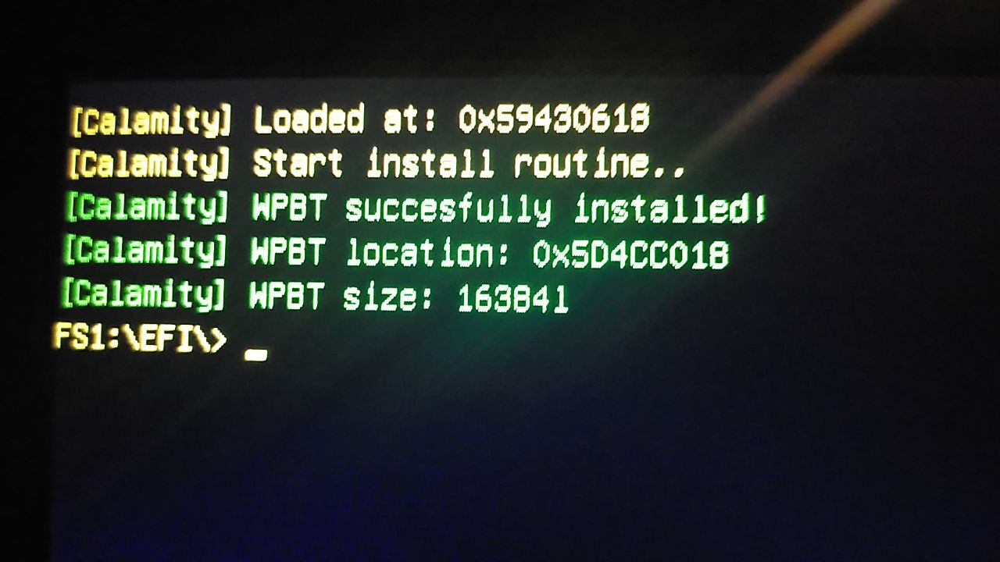
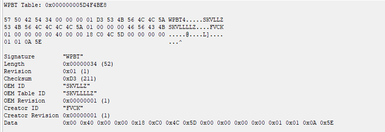

**Calamity** is a project that was written to better understand how the **Windows Platform Binary Table** (WPBT) works.

## What is WPBT?
**WPBT** is a persistent Windows mechanism that allows to keep vendor applications even if the operating system is completely reinstalled. This is achieved by moving the application from anywhere (ideally in ROM) to ACPI memory. For example, anti-theft applications can use **WPBT**.

## How to use that?
**Calamity** tries to be the easiest and friendliest implementation. You simply copy your application into the `Driver.h` header file and compile the EFI driver itself. After compiling, transfer the driver itself to the USB, then create an `EFI\Boot` partition and transfer the `Shell.efi` file from the repository, previously renamed `bootx64.efi`, to the created partition on the USB. Applications that use WPBT have their own limitations, which are described below.

## Restrictions
PE files that use the **WPBT** mechanism must be built with the `NATIVE` subsystem, and they must necessarily be Ring 3 (User Mode) applications. Also, for such applications, only functions from `ntdll` (and no more!) can be used as dependencies. Also, the application must be signed, you can use your own certificate or use certificates from different leaks (also, don't forget to set `/INTEGRITYCHECK` in the linker settings). An example of a native application is in the repository.

## Compilation
The project uses [VisualUefi](https://github.com/ionescu007/VisualUefi) to make working with [EDKII](https://github.com/tianocore/edk2) easier. You may have to change the paths for header files and libraries in the project.

## Images

## Documentation
**WPBT** documentation is [available](https://download.microsoft.com/download/8/a/2/8a2fb72d-9b96-4e2d-a559-4a27cf905a80/windows-platform-binary-table.docx) on MSDN in `.docx` format.

### Credits
SKVLLZ. (2023)
